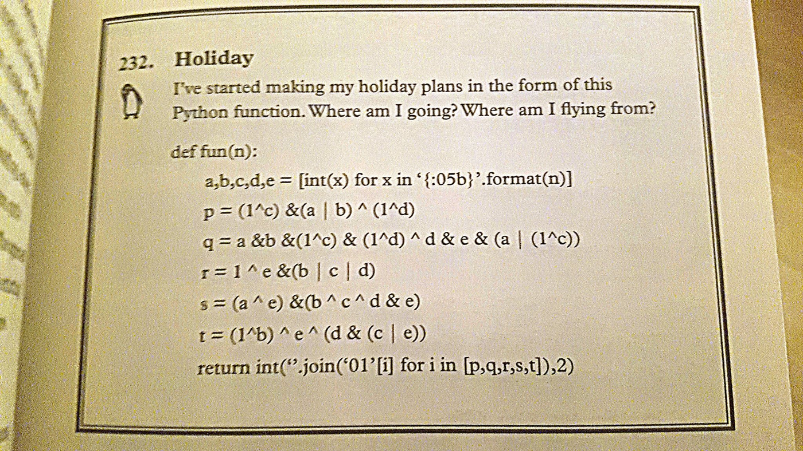
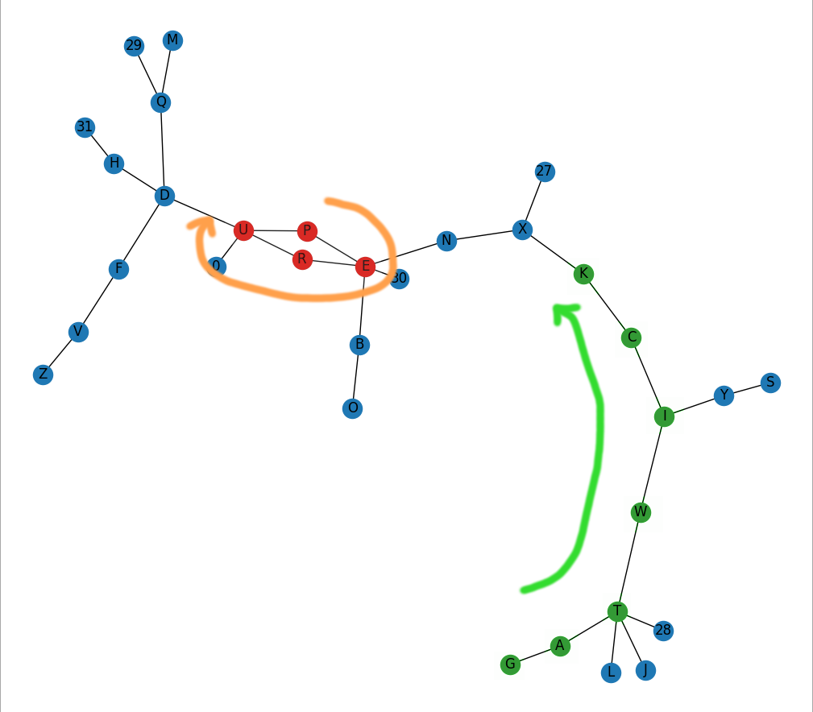

# Solution to puzzle 232 of the GCHQ Puzzle Book II

- Question 232:

- As given, the function has a typo in the last line (the list comprehension is missing square brackets),
  but adding these and generating all numbers in the binary range of 00000 to 11111, there is a directed graph
  which when plotted 'starts' (at one end) as "GATWICK" and has a cycle looping around the letters that spell out "PERU"

- The Python script uses the network generated from running this function (run `generate_network.py` to create it)

- The output is two figures matching the solutions in the book (only the latter of which is really needed, in which the
  cipher shows the place names).

